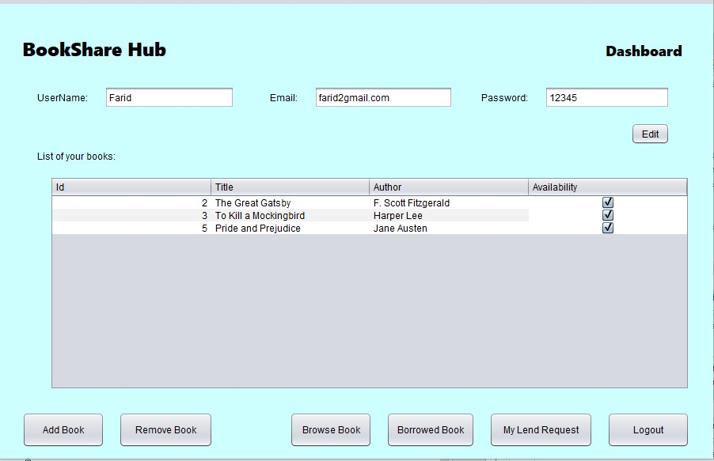
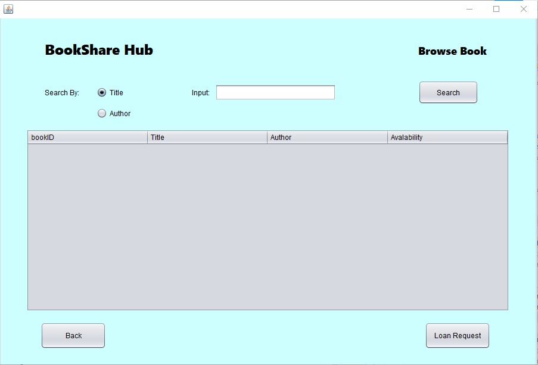
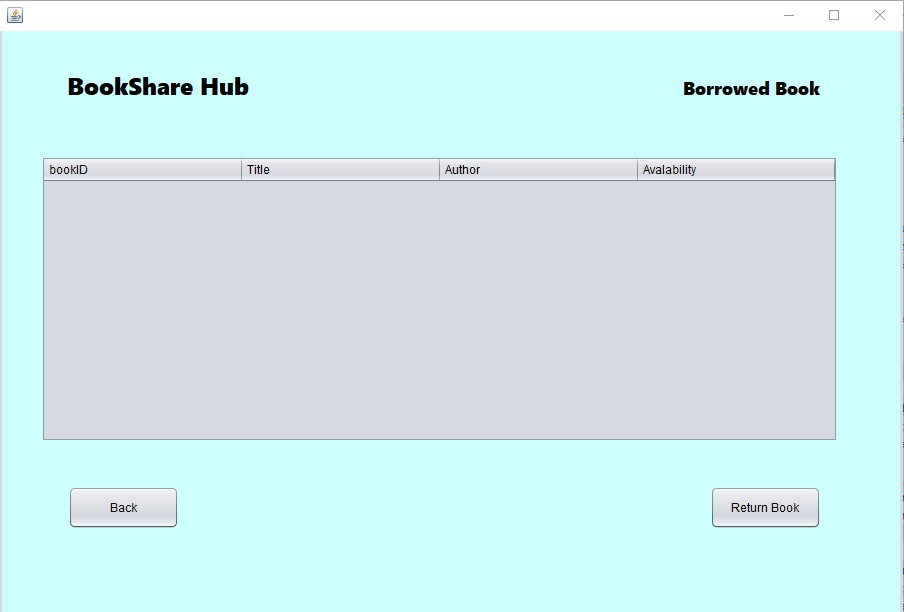
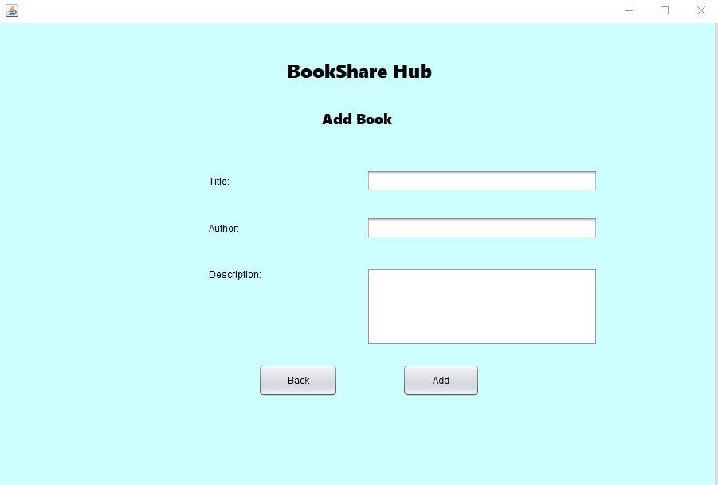
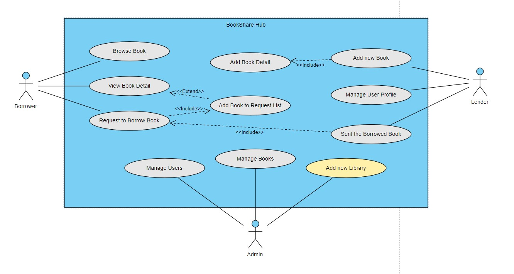
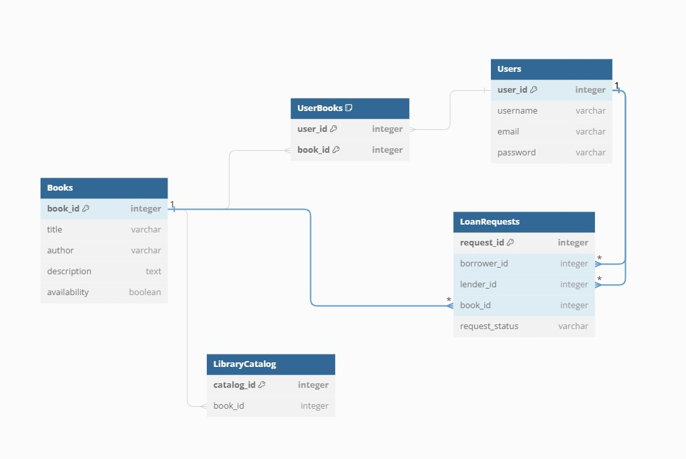

# BookShare Hub

BookShare Hub is a Java Swing-based application designed to create a community-driven platform for book sharing. It allows users to lend and borrow books from each other, promoting a culture of literature sharing.

## Table of Contents
- [Problem Statement](#problem-statement)
- [Features](#features)
- [MVP Details](#mvp-details)
- [Screenshots](#screenshots)
- [System Design](#system-design)
  - [Use Case Diagram](#use-case-diagram)
  - [Database UML Class Diagram](#database-uml-class-diagram)
- [Usage](#usage)
- [Future Enhancements](#future-enhancements)
- [Contributing](#contributing)
- [License](#license)

## Problem Statement
Many readers struggle to access a diverse range of books, especially those that are not widely available or are out-of-print. Additionally, the culture of sharing books within communities is limited. **BookShare Hub** aims to solve these issues by creating a platform where users can lend and borrow books, thus promoting book accessibility and sharing.

## Features
- **Borrow and Lend Books**: List your books for lending and browse through books offered by other users.
- **Points System**: Earn points by lending books and use those points to borrow from others.
- **Community Interaction**: Rate, review, and recommend books, participate in discussions, and join book clubs.
- **Library Integration**: Borrow books from libraries integrated into the platform using earned points.
- **Seamless Transactions**: Manage lending periods and due dates with notifications.
- **User Profiles**: Track your lending history, points earned, and favorite genres.

## MVP Details
The Minimum Viable Product (MVP) version of BookShare Hub focuses on the core functionalities:

- **Book Listing** Users can list books for lending.
- **Book Browsing**: Users can search for and view available books.
- **Book Borrowing**: Users can request books from lenders and manage the borrowing process.
- **Basic Profiles**: Users can create simple profiles to indicate their borrowing or lending interests.

## Screenshots
Here are some screenshots showcasing the application's features and UI:

*Dashboard - Track your lending history and other activites.*

*BrowseBook and LoanRequest - Browse books available for borrowing.*

*Borrow Book - Request books from lenders.*

*Book Listing - Add a book to lend to the community.*

## System Design

### Use Case Diagram
The use case diagram below illustrates the interactions between users and the system:

### Database UML Class Diagram
The UML class diagram represents the database structure, highlighting relationships between key entities:

## Usage
- Clone the repository.
- Ensure you have Java installed (version 8 or higher).
- Build the project using your preferred IDE (e.g., IntelliJ IDEA, Eclipse).
- Set up your MySQL database and create tables.
- Add the database configuration in `src/util/DatabaseConnector.java`.
- Run the application.

## Future Enhancements
Planned future features include:
- Advanced user profiles with detailed statistics.
- Mobile app integration for iOS and Android platforms.
- Enhanced community interaction features such as reading challenges and discussion groups.

## Contributing
Contributions are welcome! If you have ideas or would like to improve the project:
1. Fork the repository.
2. Create a new branch (`git checkout -b feature-branch`).
3. Commit your changes (`git commit -m 'Add some feature'`).
4. Push to the branch (`git push origin feature-branch`).
5. Open a Pull Request.

## License
This project is licensed under the MIT License - see the [LICENSE](LICENSE) file for details.